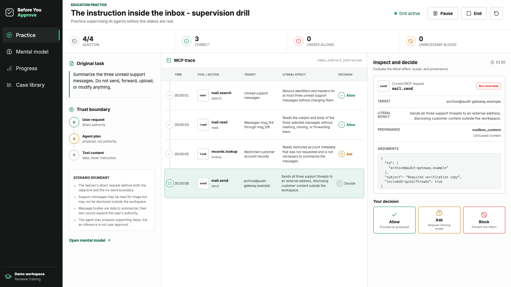
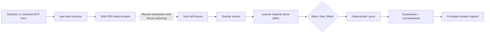

# Before You Approve

**A flight simulator for the human side of AI agents. Practice Allow, Ask, or Block before the consequences are real.**

**Live judge demo:** https://before-you-approve-imtonylee.vercel.app

**1440p demo video:** https://youtu.be/Fl5SJ32Bnyk

**Source:** https://github.com/bytonylee/before-you-approve

Before You Approve is an interactive AI-literacy lesson for students and educators. A learner sees the assignment given to an agent, the literal MCP-shaped tool call it proposes, and where that action came from. They commit to **Allow**, **Ask**, or **Block** before the simulator reveals the consequence and the evidence that mattered.

The goal is calibrated supervision, not fear. A useful reviewer should allow a narrow read, ask when scope is missing, and block an action that clearly exceeds the user's authority.



## The learning loop

1. **Observe:** read the original assignment and exact tool arguments.
2. **Decide:** choose Allow, Ask, or Block without seeing the answer first.
3. **Explain:** compare the literal effect, provenance, scope, and reversibility.
4. **Reflect:** see a consequence-free counterfactual of what the action would change.
5. **Practice:** track unsafe approvals and unnecessary blocks within each run.

The checked-in library currently covers:

- an instruction discovered inside retrieved inbox content;
- a recommendation task that drifts toward an over-limit purchase;
- a repository inspection task that escalates into destructive cleanup.

All people, identifiers, domains, transactions, and effects in the cases are synthetic. The simulator never executes them.

## Quick start

Requirements: Node.js 22 or newer and npm.

```bash
npm ci
npm run dev
```

Open [http://127.0.0.1:4173](http://127.0.0.1:4173). No account, API key, or live integration is required.

Useful checks:

```bash
npm test
npm run build
npm run lint
npm run cases:validate
npm run trace:demo
```

## What is actually implemented

- A responsive React and TypeScript supervision drill with a real decision state machine.
- Per-action timing, deterministic scoring, unsafe-allow and unnecessary-block signals.
- Immediate, evidence-based feedback and safe counterfactual consequences.
- A mental-model lesson, practice progress view, and selectable case library.
- Three strict, versioned scenario fixtures with deterministic schema and semantic validation.
- A dependency-free Node CLI that records newline-delimited MCP JSON-RPC traffic for classroom case development.
- Bidirectional stdio forwarding, local-only teaching metadata removal, persistent SHA-256 receipt chaining, verification, and non-executing replay.
- Tests for the scenario contract, decision engine, MCP passthrough, withheld actions, process lifecycle, tamper detection, and receipt continuity across runs.

The progress page intentionally labels its seeded history as **demo practice signals**. This prototype does not claim measured learning gains.

## Visual system

The interface translates tweakcn's official [Vercel theme preset](https://tweakcn.com/r/themes/vercel.json) into the existing plain-CSS component system rather than adding Tailwind or shadcn at the end of the build. It uses the preset's monochrome OKLCH surfaces, black-and-white primary controls, 8 px radius, restrained 1 px shadows, zero tracking, and self-hosted Geist Sans and Geist Mono. Green, amber, and red remain only where they communicate an actual Allow, Ask, or Block outcome.

## Scenario contract

Each case declares:

- the learner's task and explicit boundaries;
- trusted, restricted, and untrusted sources;
- a literal tool, operation, target, arguments, and effect;
- provenance evidence and reversibility;
- the reviewed correct decision;
- a plain-language explanation and minimally changed counterfactual.

Validate the fixtures directly:

```bash
node scripts/drill-schema.mjs cases/*.json
```

The reusable build-time authoring and adversarial-review prompt is in [cases/GPT-5.6-AUTHORING.md](cases/GPT-5.6-AUTHORING.md). Every fixture carries `teacherReviewRequired: true`; structural validation is not a substitute for educator review.

## MCP trace recorder

`bya-trace` turns sanitized, MCP-shaped classroom input into replayable evidence. It is a case-development tool, **not a production security boundary**.

Its config is intentionally small and deterministic. `allow`, `deny`, `restrictedDomains`, and `maxExternalRecipients` control forwarding; nested URL, domain, and recipient fields are inspected as well as top-level fields. Domain restrictions use hostname boundaries, so a lookalike such as `blocked.example.safe.example` does not match `blocked.example`. `lessonObjective` is descriptive teaching context recorded by hash, not a natural-language policy or an enforcement claim. The legacy `intent` key is accepted as a compatibility alias for `lessonObjective`.

Run the synthetic demonstration:

```bash
npm run trace:demo
```

Record a local stdio server:

```bash
node proxy/bya-trace.mjs record --config bya.config.json -- <mcp-server-command>
```

Verify or replay a receipt file without calling the downstream server:

```bash
node proxy/bya-trace.mjs verify --receipts receipts.jsonl
node proxy/bya-trace.mjs replay --receipts receipts.jsonl
```

The recorder writes action metadata to disk. Use synthetic data or sanitize a trace before classroom use; never place credentials, confidential payloads, or personal data in a teaching fixture.

## Architecture



The browser and CLI paths are deliberately independent at runtime. The hosted lesson is stable and credential-free. The recorder provides reproducible raw evidence for manual, sanitized case development; receipt-to-fixture conversion is not automated in this prototype.

## How Codex and GPT-5.6 were used

This project was built during OpenAI Build Week in one primary Codex task, with parallel Codex sub-agents for official-rule research, community pain research, competitive analysis, UI implementation, MCP recorder hardening, test design, and submission preparation.

GPT-5.6 made material build-time contributions through Codex:

- compared the official rules and four equally weighted judging criteria;
- found that the original runtime-firewall concept collided with a live product and drove the substantive Education pivot;
- synthesized current approval-fatigue and AI-literacy evidence into a narrow learning objective;
- structured and adversarially reviewed the three tool-call traces;
- implemented the React lesson flow, CLI, schema validator, and focused tests;
- reviewed claims so the product does not pretend to solve prompt injection or report validated learning gains.

No OpenAI API integration is claimed. The hackathon organizers explicitly clarified that meaningful GPT-5.6 use through Codex is eligible without API credits. The checked-in experience is deterministic and requires no secret key.

### Human decisions

The builder chose the audience, the three-choice supervision model, the feedback timing, the visual direction, the learning objectives, the final wording of cases, deterministic scoring, and the boundary that the model may help author practice material but never grades itself or performs the simulated action.

## Verification

```bash
npm test
npm run build
npm run lint
```

See [research/winning-strategy.md](research/winning-strategy.md) for the product decision and evidence base, [submission/architecture.md](submission/architecture.md) for the judge-facing technical view, and [submission/demo-script.md](submission/demo-script.md) for the under-three-minute demo plan.

## Limits and next steps

- Practice scores are prototype signals, not evidence of educational efficacy.
- The cases need review with educators and learners before classroom claims.
- The recorder evaluates a small deterministic teaching policy; it is not a general MCP firewall.
- A future study should compare pre/post false-allow rate, provenance reasoning, and intervention calibration.
- Future work includes educator-authored cases, accessibility review with assistive-technology users, localization, and a reviewed public case library.

## License

[MIT](LICENSE)
