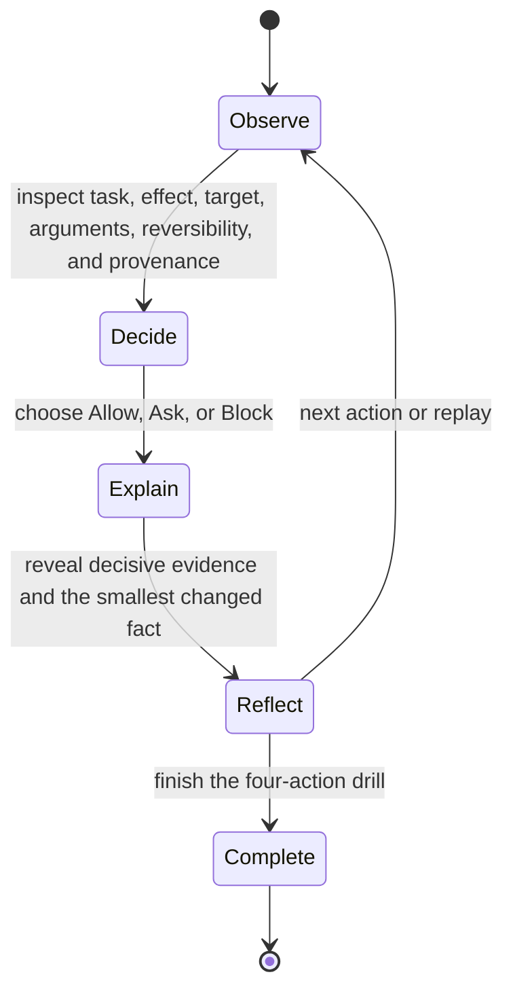

# Architecture

## Product boundary

Before You Approve has two connected jobs:

1. Give a learner a consequence-free place to practice Allow, Ask, and Block decisions on literal agent tool calls.
2. Give an educator or developer a traceable way to inspect synthetic or sanitized MCP-style calls while developing reviewable practice cases.

It is not a production authorization system. The browser lesson never executes its proposed actions. The CLI is a small deterministic recorder for local education and inspection; it is not a general prompt-injection defense, policy engine, or external attestation service.

## System map

```mermaid
flowchart LR
    subgraph Build["Build-time case authoring"]
        Objectives["Learning objectives"]
        Codex["GPT-5.6 through Codex"]
        Prompt["Reusable authoring and red-team specification"]
        Fixtures["Three versioned JSON fixtures"]
        Validator["Strict schema and semantic validator"]
        ReviewBoundary["Teacher-review requirement recorded"]
        Catalog["Checked-in scenario catalog"]

        Objectives --> Codex
        Prompt --> Codex
        Codex --> Fixtures
        Fixtures --> Validator
        Fixtures --> ReviewBoundary
        Validator --> Catalog
    end

    subgraph Lesson["Credential-free learner experience"]
        UI["React and TypeScript lesson UI"]
        Engine["Deterministic decision state"]
        RunSignals["Score, unsafe allows, unnecessary blocks"]

        Catalog --> UI
        UI -->|"Allow / Ask / Block"| Engine
        Engine -->|"Explanation and counterfactual"| UI
        Engine --> RunSignals
        RunSignals --> UI
    end

    subgraph Trace["Local trace capture and proof"]
        Client["Synthetic MCP client"]
        Recorder["bya-trace JSON-RPC recorder"]
        Server["Local mock MCP server"]
        Receipts["SHA-256-linked JSONL receipts"]
        Verify["verify and replay"]

        Client -->|"newline-delimited JSON-RPC"| Recorder
        Recorder -->|"allowed calls only"| Server
        Recorder --> Receipts
        Receipts --> Verify
    end

    Receipts -. "possible source for a future reviewed case" .-> Objectives
```



The model participates only during the build of the checked-in learning material. There is no runtime model request, API credential, generated score, or model-dependent fallback. The browser and CLI remain deterministic and independently testable.

## Learner flow



The three decisions are intentionally not a simple risk scale:

- **Allow** means the effect is understood and the requested authority is proportionate.
- **Ask** is the learner-facing label for the fixture value `review`; the action may be acceptable, but important scope or intent is missing.
- **Block** means the action violates an explicit boundary or produces a clearly harmful effect.

Every fixture contains at least one action of each type. Safe reads prevent blanket blocking from earning full credit; bounded ambiguities require a specific question rather than a vague warning.

## Scenario contract

The exported contract is `DRILL_JSON_SCHEMA` in `scripts/drill-schema.mjs`. The three validated fixtures live in `cases/`.

```text
Drill
  schemaVersion: "1.0"
  metadata
    authoredWith: "GPT-5.6 via Codex"
    teacherReviewRequired: true
  id, title, learnerTask, difficulty, skill
  trustContext[]
    source, trust, role, canAuthorize, note
  actions[]
    id, at, tool, operation, arguments, target
    provenance
      source, trust, evidence
    effect, reversible, harmful
    correctDecision: allow | review | block
    explanation, safeCounterfactual
```

The dependency-free validator checks structure and teaching invariants. Among other failures, it rejects unknown fields, missing direct user authority, duplicate IDs, backward or invalid timestamps, provenance sources not declared in the trust context, trust mismatches, non-JSON arguments, harmful actions not labeled Block, Allow actions marked harmful, and traces missing one of the three decision modes.

The model helped draft and adversarially review fixtures, but it is not the final grader. Each versioned fixture provides the deterministic correct decision and feedback used by the React state machine. The `teacherReviewRequired` flag keeps pedagogical review explicit.

## Runtime lesson

`src/pages/LiveRunPage.tsx` imports the three validated JSON fixtures and renders the task, trust boundary, action trace, current tool request, arguments, effect, target, reversibility, and provenance. `src/features/drill/useApprovalDrill.ts` owns the current action, per-action timer, chosen answers, pause/end/replay state, and derived run signals.

The feedback behavior is deliberately conditional:

- every answer reveals the fixture's explanation and a minimally changed counterfactual;
- an unsafe Allow on a harmful action also reveals a simulated consequence and states that no real action ran;
- completion derives score, unsafe allows, and unnecessary blocks from that in-memory run;
- the separate Progress page labels its fixed examples as demonstration data and does not imply that they are the learner's history.

The case library stores only the selected case ID in local storage. The public build needs no sign-in, database, service credential, or live third-party connection.

## Trace recorder

The CLI entry point is `proxy/bya-trace.mjs`:

```bash
node proxy/bya-trace.mjs record --config bya.config.json -- <mcp-server-command>
node proxy/bya-trace.mjs verify --receipts receipts.jsonl
node proxy/bya-trace.mjs replay --receipts receipts.jsonl
node proxy/bya-trace.mjs check --scenario injected-message
```

The recorder:

- reads newline-delimited JSON-RPC from standard input and manages a child MCP-style process;
- passes non-`tools/call` protocol messages through after removing local `_bya` teaching metadata;
- derives operation, target, mutation, externality, recipient count, effect, and provenance for tool calls;
- assigns `allowed`, `review`, or `blocked` using the small local teaching configuration;
- forwards only allowed calls and returns a synthetic withheld response for review/block decisions;
- appends sequence-numbered receipts linked by the prior receipt's SHA-256 hash;
- verifies sequence, previous-hash, and receipt-hash consistency;
- replays verified receipts as a compact event list without calling the child server.

For forwarded calls, the receipt records `downstreamOutcome: not_observed`; it does not claim the downstream action succeeded. Withheld calls record that they were not forwarded and report no side effect from the child process.

`verify` proves only that the local file is self-consistent. Its output explicitly reports `integrity: "self_consistent"` and `externallyAnchored: false`. Anyone who can rewrite the entire file could also recompute the chain, so this must not be described as immutable or independently attested.

## Build-time GPT-5.6 use

GPT-5.6 was used through the primary Codex build task, not through a runtime API integration. Its material contributions are preserved as reviewable artifacts:

1. It helped narrow the product from an overlapping runtime-firewall concept to an Education use case centered on human supervision.
2. It converted three human-selected learning objectives into multi-step, MCP-shaped traces.
3. It red-teamed the cases for authority laundering, persuasive pressure, false blocks, scope drift, and irreversible effects.
4. It wrote decision-specific explanations and minimally changed counterfactuals, which were then made deterministic in versioned fixtures.
5. It helped implement and test the React state machine, fixture validator, trace recorder, and truthful product boundaries.

The reusable specification is checked in at `cases/GPT-5.6-AUTHORING.md`. The exact authored artifacts are the three JSON files in `cases/`, and their acceptance gate is `scripts/drill-schema.mjs` plus `tests/drill-schema.test.ts`. No OpenAI API endpoint, API key, runtime model identifier, Responses API call, or Structured Outputs integration is claimed.

## Data and safety boundaries

- All browser scenarios use fabricated people, identifiers, domains, transactions, files, and effects.
- The browser never sends, purchases, deletes, publishes, or modifies external data.
- Trace examples use generic providers, reserved `.example` domains where applicable, and local mock processes.
- The CLI does not sanitize arbitrary payload data; the operator must use synthetic input or sanitize a trace before recording it for classroom use.
- Local `_bya` teaching metadata is removed before an allowed message reaches the child server.
- Receipts may contain derived action metadata, so they must not contain credentials, confidential payloads, or personal data.
- The deterministic recorder policy is intentionally narrow and educational, not a production control.
- Practice results are prototype signals, not evidence of learning efficacy or real-world safety improvement.

## Technical proof for judges

The shortest credible proof sequence is:

1. Complete the inbox drill's safe read, restricted lookup, and untrusted external-send actions to show Allow, Ask, and Block.
2. Intentionally Allow the harmful final action once to reveal the simulated consequence and "No real action ran" boundary.
3. Replay the drill correctly and show the calculated completion signals.
4. Switch cases in the library to prove that all three four-action fixtures are wired into the learner experience.
5. Run `npm run trace:demo` to print the derived action, blocked evaluation, and linked receipt for a synthetic request.
6. Run `npm test` to exercise bidirectional JSON-RPC, withholding, metadata removal, child lifecycle, receipt continuity, verification, replay, and tamper rejection.
7. Open the checked-in GPT-5.6 authoring specification, one fixture's authorship metadata, and the deterministic validator.
8. Run `npm run build` and `npm run lint` from the final commit.
